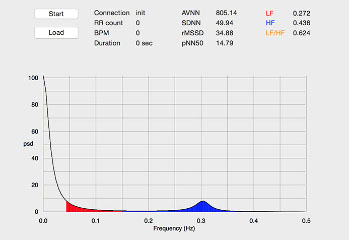
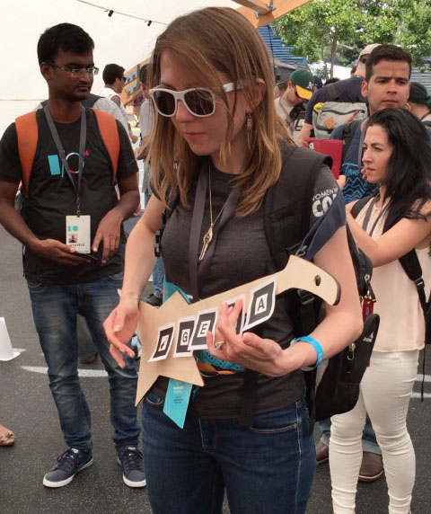
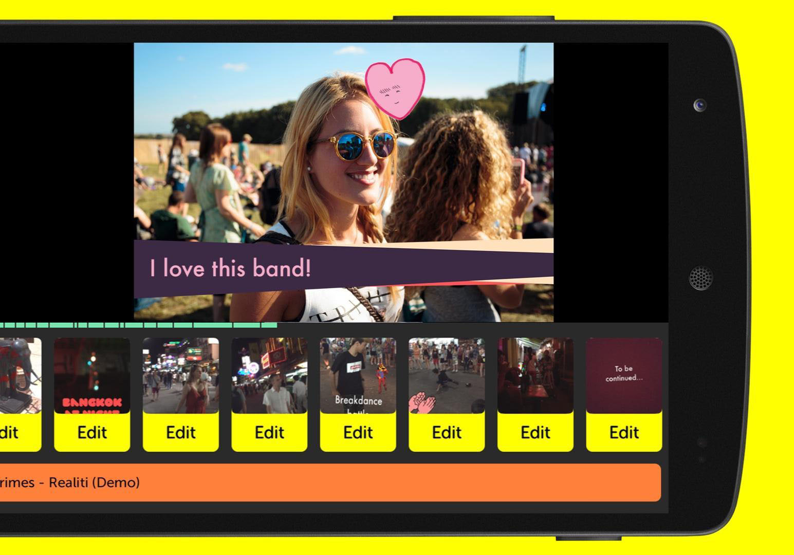
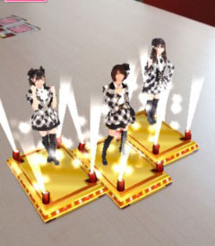
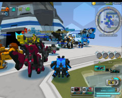
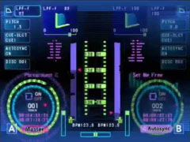

---
# You don't need to edit this file, it's empty on purpose.
# Edit theme's home layout instead if you wanna make some changes
# See: https://jekyllrb.com/docs/themes/#overriding-theme-defaults
# layout: home2
title: 
layout: page2
---

## About

## Open source projects

# UNREAL

Reproducing DeepMind paper "Reinforcement Learning with Unsupervised Auxiliary Tasks" with TensorFlow & DeepMindLab.

[https://github.com/miyosuda/unreal](https://github.com/miyosuda/unreal)

<iframe width="560" height="315" src="https://www.youtube.com/embed/xHK0qBeH3-I" frameborder="0" allowfullscreen></iframe>

# A3C

Reproducing DeepMind paper "Asynchronous Methods for Deep Reinforcement Learning" with TensorFlow.

[https://github.com/miyosuda/async_deep_reinforce](https://github.com/miyosuda/async_deep_reinforce)

<iframe width="280" height="158" src="https://www.youtube.com/embed/KJt1X-tRCbw" frameborder="0" allowfullscreen></iframe>

# Disentangled VAE

Reproducing DeepMind paper "Early Visual Concept Learning with Unsupervised Deep Learning."

  

[https://github.com/miyosuda/disentangled_vae](https://github.com/miyosuda/disentangled_vae)

# Heart rate variability analysis tool

[https://github.com/miyosuda/heartrate-monitor](https://github.com/miyosuda/heartrate-monitor)

Heart rate variability (HRV) analysis tool to detect autonomic nerve state using auto regressive method.

  
  

-----

## Work Experience

# Narrative Nights Inc. (2011.07 ~)

Representative

* Nirvana (WebGL/iOS/Andoid)

  Security alert visualizer development (C#,ShaderLab)
  
  

* Daedalus (WebGL/iOS/Andoid)

  Security alert visualizer development (C#,ShaderLab)

  

* AR Music Kit for GoogleI/O 2016 by Yuri Suzuki (Andoid)

  AR development (C++,Java)

  [https://www.androidexperiments.com/experiment/ar-music-kit](https://www.androidexperiments.com/experiment/ar-music-kit)

  
  

* Picute by MTI inc. (Android/iOS)

  GPU Filter system development (Objective-C,C++,Java,GLSL)

  

* Nicter Atlas/Cube (iOS/Andoid)

  Cyber attack visualizer development (C#,ShaderLab)

  

* Pocket Video by Pocket Supernova Inc. (iOS/Andoid)

  - GPU based editing system development (C++,Objective-C,Java)
  - DSP programming (C++)

    

* AKB48 AR card & collection by MTI Inc. (iOS/Android)

  AR develpment (C++,Objective-C,Java)

  

# Cyber Step Inc. (2005.08 ~ 2011.6)

Chief programmer

* Cosmic Break
  - Server side development (Java)
  - Game client/graphics development (Java/OpenGL)
  - P2P Voice chat system devepment (C++)

  

* GetAmped2

  Sound streaming server/client development (C++,Java)
  
  

* Monemone

  Server/Client development (PHP,Java,squirrel)

  
  

# Sony Computer Entertainment Inc. (2000.07 ~ 2004.12)

Programmer

* ALIFE prototype (PlayStation2)

  Developed genetic programming learning & physics simulation system. (C++)

    <iframe width="560" height="315" src="https://www.youtube.com/embed/0HeZBc2_DZc" frameborder="0" allowfullscreen></iframe>

* DJ Box (PlayStation2, PSX)

  Auto DJ playing system development (C++)

  

* Toro to Kyujitsu (PlayStation2)

  Chatterbot script programming. (Original DSL)

  

* Rimococoron

  Production tool development (C++,Java)

  
